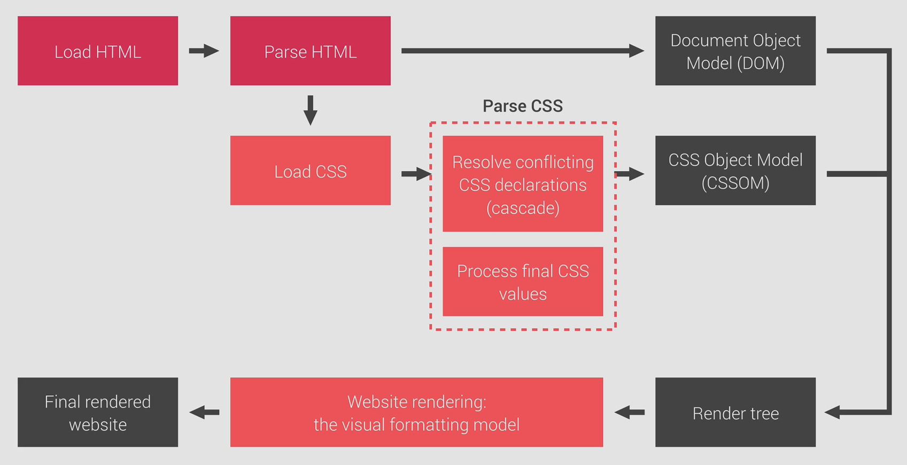

# How CSS works behind the scenes
## 3 pillars of writing good HTML & CSS
### Responsive design
- fluid layouts
- media queries
- responsive images
- correct units
- desktop-first vs mobile-first

### Maintainable & scalable code
- how to organize files
- how to name classes
- how to structure HTML

### Web performance
- less HTTP requests
- less code / compress code
- use CSS preprocessor (eg; SASS)
- less images / compress images ()

## Overview

## How CSS is parsed
### Cascade
여러 stylesheet(author, user, browser)를 합치면서, 요소에 1개 이상의 규칙이 적용될 때 발생하는 충돌을 해결하는 과정
- 우선순위
  - importance: !important 선언 등
  - specificity: inline style > ID > class, pseudo-class, attribute > elements, pseudo-elements
  요소 안에 해당 범주의 개수를 측정((0,1,2,3) 처럼)하고 순서대로 비교하면서 먼저 나온 것+숫자가 큰 것을 우선적으로 적용한다.
  - source order: specificity까지 같다면 가장 마지막에 선언된 내용이 적용된다.

- universal selector는 (0,0,0,0) 값이므로 우선순위가 가장 낮다.
- 순서보다는 specificity에 의존하는 것이 유지보수하기가 좋다.
- 서드파티 stylesheet를 사용하는 경우에는 순서가 중요. author stylesheet를 마지막에 둔다.
